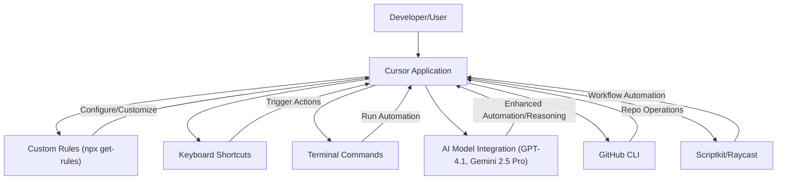

# User Interactions Diagram

```mermaid
graph TD
  user["Developer/User"] --> cursor["Cursor Application"]
  cursor --> rules["Custom Rules (npx get-rules)"]
  cursor --> shortcuts["Keyboard Shortcuts"]
  cursor --> terminal["Terminal Commands"]
  cursor --> ai["AI Model Integration (GPT-4.1, Gemini 2.5 Pro)"]
  cursor --> githubcli["GitHub CLI"]
  cursor --> scriptkit["Scriptkit/Raycast"]
  rules -->|"Configure/Customize"| cursor
  shortcuts -->|"Trigger Actions"| cursor
  terminal -->|"Run Automation"| cursor
  ai -->|"Enhanced Automation/Reasoning"| cursor
  githubcli -->|"Repo Operations"| cursor
  scriptkit -->|"Workflow Automation"| cursor
```
